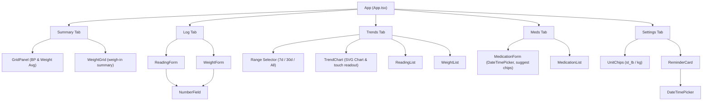
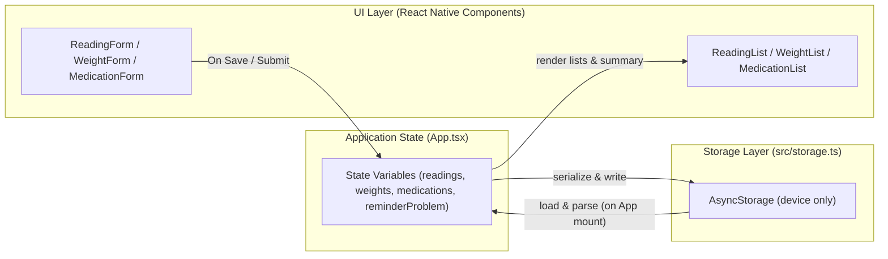

# Health App Architecture

This document describes the design, data flow, and component relationships of the Personal Health App.

## Component Hierarchy

The application layout consists of a bottom tab bar navigation controlling the main visible view, safe-area containers, and a keyboard-avoiding wrapper. The view switches between five primary tab states, rendering corresponding forms, lists, and utilities.



---

## Data Flow & Storage

All user data is stored on-device only via `AsyncStorage`. Readings (blood pressure and heart rate) and weight logs are loaded into the React state when the application mounts, and updates are serialized and saved whenever logs are added or deleted.



---

## Notification Scheduling Lifecycle

Reminders utilize local OS alarms. Since Android Expo Go SDK 53+ lacks support for `expo-notifications`, a runtime guard is used to lazily import the notification module only where supported, preserving core application functionality on Android Expo Go.

```mermaid
sequenceDiagram
    autonumber
    actor User as User Action
    participant App as App.tsx
    participant Note as src/notifications.ts
    participant Expo as expo-notifications (OS Native)

    Note->>Note: Check Platform (Android Expo Go Guard)
    alt Android && Expo Go (SDK 53+)
        Note-->>App: Return 'unsupported' status
        Note-->>App: Skip importing expo-notifications (prevent crash)
    else Supported Platform (iOS or Android Dev Build)
        User->>App: Toggle / Update Reminder Settings
        App->>Note: scheduleReminder(kind, settings) / scheduleMedicationReminders(med)
        Note->>Note: Check & request local notification permissions
        alt Permissions Denied
            Note-->>App: Return 'denied' status
        else Permissions Granted
            Note->>Expo: Get all scheduled notifications
            Note->>Expo: Cancel previous matching reminders
            alt Settings.enabled == true
                Note->>Expo: Schedule Daily (BP/Meds) or Weekly (Weight) trigger
                Note-->>App: Return 'scheduled' status
            else Settings.enabled == false
                Note-->>App: Return 'cancelled' status
            end
        end
    end
```
